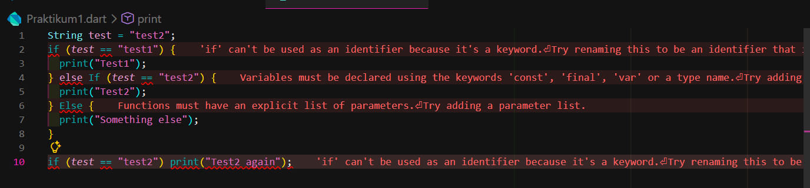
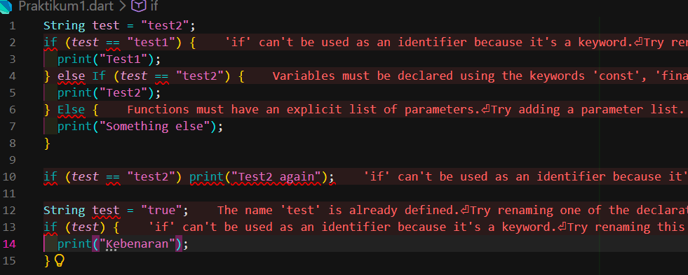
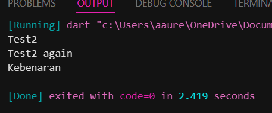
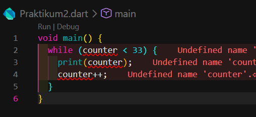
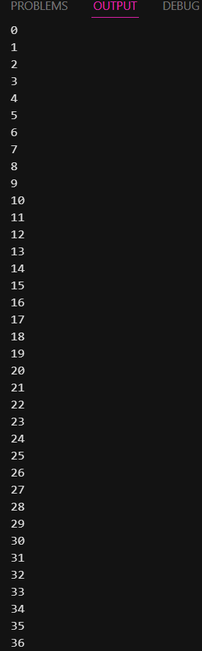
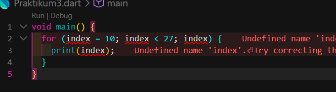
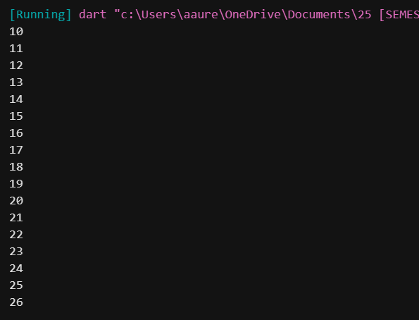
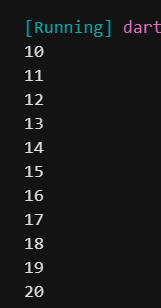
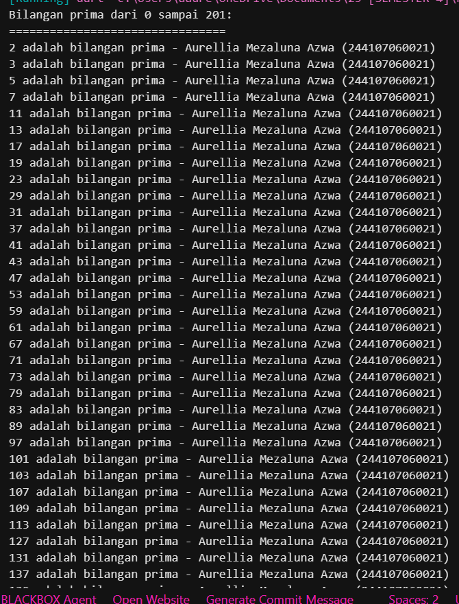

# Laporan Pertemuan 3

## Identitas Mahasiswa

| Atribut | Nilai                  |
| ------- | ---------------------- |
| Nama    | Aurellia Mezaluna Azwa |
| NIM     | 244107060021           |
| Kelas   | SIB-2D                 |

## Praktikum 1 - Langkah 1

menyalin kode yang ada pada soal, dan hasilnya sebagai berikut :

```dart
String test = "test2";
if (test == "test1") {
  print("Test1");
} else If (test == "test2") {
  print("Test2");
} Else {
  print("Something else");
}
if (test == "test2") print("Test2 again");
```

### Langkah 2

Silakan coba eksekusi (Run) kode pada langkah 1 tersebut. Apa yang terjadi? Jelaskan!

**Jawaban :**



Mengapa bisa error? Karena mengandung kesalahan sintaks. Kata kunci If dan Else seharusnya ditulis dengan huruf kecil (if dan else) karena Java bersifat case-sensitive. Selain itu, method print seharusnya ditulis System.out.print atau System.out.println.

### Langkah 3

menambahkan kode yang ada pada soal, jika salah maka perbaiki namun tetap menggunakan if/else. maka hasilnya sebagai berikut :

```dart
String test = "test2";
if (test == "test1") {
  print("Test1");
} else If (test == "test2") {
  print("Test2");
} Else {
  print("Something else");
}

if (test == "test2") print("Test2 again");

String test = "true";
if (test) {
  print("Kebenaran");
}
```



Pada potongan kode baru if (test) { ... } dengan test bertipe String berisi "true", ini akan menyebabkan error karena Java tidak bisa mengonversi String menjadi boolean secara otomatis. Sekarang coba saya perbaiki dengan tetap mempertahankan if/else. Berikut hasilnya :

```dart
void main() {
  String test = "test2";
  if (test == "test1") {
    print("Test1");
  } else if (test == "test2") {
    print("Test2");
  } else {
    print("Something else");
  }

  if (test == "test2") print("Test2 again");

  String test2 = "true";
  if (test2 == "true") {
    print("Kebenaran");
  }
}
```



### Praktikum 2 - Langkah 1

menyalin kode yang ada pada soal, dan hasilnya sebagai berikut :

```dart
void main() {
  while (counter < 33) {
    print(counter);
    counter++;
  }
}
```

### Langkah 2

Silakan coba eksekusi (Run) kode pada langkah 1 tersebut. Apa yang terjadi? Jelaskan! Lalu perbaiki jika terjadi error.

**Jawaban :**



Error karena variabel counter belum dideklarasikan dan belum diberi nilai awal sebelum digunakan di dalam loop while.

### Langkah 3

menambahkan kode sebagai berikut :

```dart
void main() {
  int counter = 0;
  while (counter < 33) {
    print(counter);
    counter++;
  }

  do {
    print(counter);
    counter++;
  } while (counter < 77);
}
```



## Praktikum 3 - Langkah 1

menyalin kode yang ada pada soal, dan hasilnya sebagai berikut :

```dart
void main() {
  for (index = 10; index < 27; index) {
    print(index);
  }
}
```

### Langkah 2

Silakan coba eksekusi (Run) kode pada langkah 1 tersebut. Apa yang terjadi? Jelaskan! Lalu perbaiki jika terjadi error.

**Jawaban :**



Error karena variabel index belum dideklarasikan tipe datanya (seperti int) dan bagian increment pada for loop tidak lengkap (seharusnya index++).

**Hasil Perbaikan Kode**

```dart
void main() {
  for (int index = 10; index < 27; index++) {
    print(index);
  }
}
```

menghasilkan output sebagai berikut :



### Langkah 3

Tambahkan kode program berikut di dalam for-loop, lalu coba eksekusi (Run) kode Anda.

```dart
void main() {
  for (int index = 10; index < 27; index++) {
    if (index == 21) {
      break;
    } else if (index > 1 && index < 7) {
      continue;
    }
    print(index);
  }
}
```



## Tugas Praktikum

Buatlah sebuah program yang dapat menampilkan bilangan prima dari angka 0 sampai 201 menggunakan Dart. Ketika bilangan prima ditemukan, maka tampilkan nama lengkap dan NIM Anda.

**Jawaban :**

```dart
void main() {
  String nama = "Aurellia Mezaluna Azwa";
  String nim = "244107060021";

  print("Bilangan prima dari 0 sampai 201:");
  print("================================");

  for (int i = 0; i <= 201; i++) {
    if (isPrima(i)) {
      print("$i adalah bilangan prima - $nama ($nim)");
    }
  }
}

bool isPrima(int n) {
  if (n <= 1) return false;
  if (n == 2) return true;
  if (n % 2 == 0) return false;

  for (int i = 3; i <= n ~/ 2; i += 2) {
    if (n % i == 0) return false;
  }

  return true;
}
```


