<<<<<<< HEAD

# Laporan Pertemuan 4

## Identitas Mahasiswa

| Atribut | Nilai                  |
| ------- | ---------------------- |
| Nama    | Aurellia Mezaluna Azwa |
| NIM     | 244107060021           |
| Kelas   | SIB-2D                 |

## Praktikum 1 - Langkah 1

Menyalin kode yang ada pada soal, dan hasilnya sebagai berikut :

```dart
void main() {
  var list = [1, 2, 3];
  assert(list.length == 3);
  assert(list[1] == 2);
  print(list.length);
  print(list[1]);

  list[1] = 1;
  assert(list[1] == 1);
  print(list[1]);
}
```

## Praktikum 1 - Langkah 2

Silakan coba eksekusi (Run) kode pada langkah 1 tersebut. Apa yang terjadi? Jelaskan!

**Jawaban :**

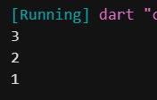

Kode berjalan tanpa error. assert digunakan untuk memeriksa kebenaran kondisi. Pada baris pertama, panjang list adalah 3, dan nilai indeks ke-1 adalah 2, sehingga dua assert pertama bernilai benar. Setelah nilai indeks ke-1 diubah menjadi 1, assert terakhir juga benar. Program mencetak panjang list yaitu 3, nilai awal indeks ke-1 yaitu 2, dan nilai setelah diubah yaitu 1.

## Praktikum 1 - Langkah 3

Ubah kode pada langkah 1 menjadi variabel final yang mempunyai index = 5 dengan default value = null. Isilah nama dan NIM Anda pada elemen index ke-1 dan ke-2. Lalu print dan capture hasilnya.

Apa yang terjadi ? Jika terjadi error, silakan perbaiki.

**Jawaban :**

```dart
void main() {
  final List<String?> list = List.filled(5, null);

  list[1] = "Nama: Aurellia Mezaluna Azwa";
  list[2] = "NIM: 244107060021";

  print(list);
}
```

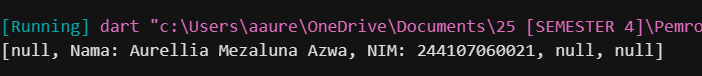

## Praktikum 2 - Langkah 1

Menyalin kode yang ada pada soal, dan hasilnya sebagai berikut :

```dart
void main() {
  var halogens = {`fluorine`, `chlorine`, `bromine`, `iodine`, `astatine`};
  print(halogens);
}
```

## Praktikum 2 - Langkah 2

Silakan coba eksekusi (Run) kode pada langkah 1 tersebut. Apa yang terjadi? Jelaskan! Lalu perbaiki jika terjadi error.

**Jawaban :**

Kode di atas error, karena penggunaan backtick (`) sebagai tanda string.
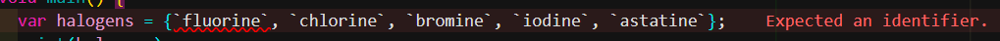

Perbaikan :

```dart
void main() {
  var halogens = {'fluorine', 'chlorine', 'bromine', 'iodine', 'astatine'};
  print(halogens);
}
```

Output :

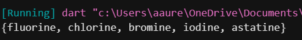

## Praktikum 2 - Langkah 3

Menambahkan kode program.
Apa yang terjadi ? Jika terjadi error, silakan perbaiki namun tetap menggunakan ketiga variabel tersebut. Tambahkan elemen nama dan NIM Anda pada kedua variabel Set tersebut dengan dua fungsi berbeda yaitu .add() dan .addAll(). Untuk variabel Map dihapus, nanti kita coba di praktikum selanjutnya.

**Jawaban :**

```dart
void main() {
  // Langkah 2: Set halogens
  var halogens = {'fluorine', 'chlorine', 'bromine', 'iodine', 'astatine'};
  print('Halogens: $halogens');

  // Langkah 3: Tiga variabel
  var names1 = <String>{};
  Set<String> names2 = {}; // This works, too.
  var names3 = {}; // Creates a map, not a set.

  print('names1 awal: $names1');
  print('names2 awal: $names2');
  print('names3 (Map): $names3');

  names1.add('Nama: Aurellia Mezaluna');
  names1.add('NIM: 244107060021');

  // Menggunakan .addAll() untuk menambah sekaligus
  names2.addAll({'Nama: Aurellia Mezaluna', 'NIM: 244107060021'});

  print('\nSetelah ditambah elemen:');
  print('names1: $names1');
  print('names2: $names2');
}
```

Output :

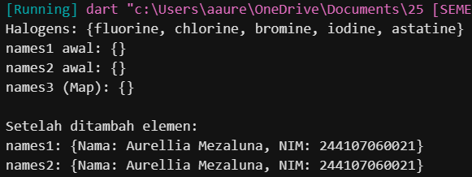

Kode di atas berjalan tanpa error. names1 dan names2 adalah dua variabel dengan tipe Set<String> yang dibuat dengan cara berbeda namun fungsinya sama. names3 bertipe Map<dynamic, dynamic> karena inisialisasi {} tanpa petunjuk tipe akan dianggap sebagai Map oleh Dart. Sesuai perintah, variabel Map dibiarkan apa adanya. Elemen nama dan NIM ditambahkan ke kedua Set menggunakan .add() (untuk names1) dan .addAll() (untuk names2). Hasil akhir menunjukkan kedua Set berisi dua elemen yang sama.

## Praktikum 3 - Langkah 1 dan 2

Menyalin kode. Kemudian silakan coba eksekusi (Run) kode pada langkah 1 tersebut. Apa yang terjadi? Jelaskan! Lalu perbaiki jika terjadi error.

**Jawaban :**

```dart
void main() {
  var gifts = {
    // Key: Value
    'first': 'partridge',
    'second': 'turtledoves',
    'fifth': 1
  };

  var nobleGases = {
    2: 'helium',
    10: 'neon',
    18: 2,
  };

  print(gifts);
  print(nobleGases);
}
```

Kode di atas berjalan tanpa error. gifts bertipe Map<String, Object> karena memiliki key bertipe String dengan value campuran (String dan int). nobleGases bertipe Map<int, Object> karena key bertipe int dengan value campuran (String dan int). Dart secara otomatis menyimpulkan tipe data yang paling sesuai. Program mencetak kedua isi map tersebut.

Output :

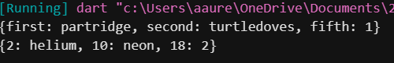

## Praktikum 3 - Langkah 3

Menambahkan kode program. Kemudian apa yang terjadi ? Jika terjadi error, silakan perbaiki.

Tambahkan elemen nama dan NIM Anda pada tiap variabel di atas (gifts, nobleGases, mhs1, dan mhs2). Dokumentasikan hasilnya dan buat laporannya!

**Jawaban :**

```dart
void main() {
  // Langkah 1 & 2
  var gifts = {'first': 'partridge', 'second': 'turtledoves', 'fifth': 1};

  var nobleGases = {2: 'helium', 10: 'neon', 18: 2};

  print('Awal gifts: $gifts');
  print('Awal nobleGases: $nobleGases');

  // Langkah 3: Tambahan kode
  var mhs1 = Map<String, String>();
  var mhs2 = Map<int, String>();

  gifts['first'] = 'partridge';
  gifts['second'] = 'turtledoves';
  gifts['fifth'] = 'golden rings';

  nobleGases[2] = 'helium';
  nobleGases[10] = 'neon';
  nobleGases[18] = 'argon';

  // gifts (Map<String, Object>)
  gifts['nama'] = 'Aurellia Mezaluna';
  gifts['nim'] = '244107060021';

  // nobleGases (Map<int, Object>)
  nobleGases[1] = 'Nama: Aurellia Mezaluna';
  nobleGases[3] = 'NIM: 244107060021';

  // mhs1 (Map<String, String>)
  mhs1['nama'] = 'Aurellia Mezaluna';
  mhs1['nim'] = '244107060021';

  // mhs2 (Map<int, String>)
  mhs2[1] = 'Aurellia Mezaluna';
  mhs2[2] = '244107060021';

  print('\nSetelah ditambah:');
  print('gifts: $gifts');
  print('nobleGases: $nobleGases');
  print('mhs1: $mhs1');
  print('mhs2: $mhs2');
}
```

Output :

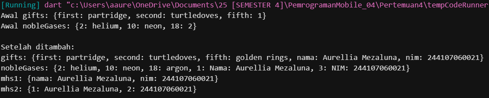

## Praktikum 4 - Langkah 1 dan 2

Menyalin kode program. Kemudian silakan coba eksekusi (Run) kode pada langkah 1 tersebut. Apa yang terjadi? Jelaskan! Lalu perbaiki jika terjadi error.

**Jawaban :**

```dart
void main() {
  var list = [1, 2, 3];
  var list2 = [0, ...list];
  print(list1);
  print(list2);
  print(list2.length);
}
```

Output :

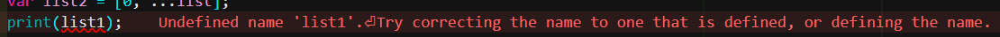

Error karena variabel yang dicetak adalah list1, padahal nama variabel yang didefinisikan adalah list. Selain itu, tidak ada variabel bernama list1.

Perbaikan :

```dart
void main() {
  var list = [1, 2, 3];
  var list2 = [0, ...list];
  print(list);
  print(list2);
  print(list2.length);
}
```

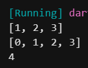

Setelah mengubah print(list1) menjadi print(list), kode berhasil dijalankan. Spread operator (...list) digunakan untuk memasukkan seluruh elemen list ke dalam list2. Hasilnya list2 berisi [0, 1, 2, 3] dengan panjang 4.

## Praktikum 4 - Langkah 3

Menambahkan kode. Kemudian apa yang terjadi ? Jika terjadi error, silakan perbaiki. Tambahkan variabel list berisi NIM Anda menggunakan Spread Operators. Dokumentasikan hasilnya dan buat laporannya!

**Jawaban :**

```dart
void main() {
  // Langkah 1 & 2
  var list = [1, 2, 3];
  var list2 = [0, ...list];
  print('list: $list');
  print('list2: $list2');
  print('list2.length: ${list2.length}');

  // Langkah 3
  var list1 = [1, 2, null];
  print('\nlist1: $list1');
  var list3 = [0, ...list1];
  print('list3: $list3');
  print('list3.length: ${list3.length}');

  // Spread operator dengan NIM
  var nimList = ['244107060021'];
  var listWithNIM = [...nimList];
  print('\nlistWithNIM: $listWithNIM');
}
```

Output :

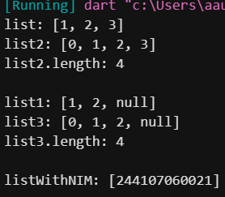

Spread operator dengan ...? (null-aware spread) digunakan karena list1 berisi nilai null namun bukan list1 itu sendiri yang bernilai null. Jika variabel yang di-spread kemungkinan bernilai null, gunakan ...? untuk mencegah error. Hasilnya list3 berisi [0, 1, 2, null] dengan panjang 4. NIM ditambahkan menggunakan spread operator ke dalam list baru.

## Praktikum 4 - Langkah 4

Menambahkan kode. Kemudian apa yang terjadi ? Jika terjadi error, silakan perbaiki. Tunjukkan hasilnya jika variabel promoActive ketika true dan false.

**Jawaban :**

```dart
void main() {
  var nav = ['Home', 'Furniture', 'Plants', if (promoActive) 'Outlet'];
  print(nav);
}
```

Output :

Error karena variabel promoActive belum didefinisikan. Dart tidak mengenali variabel tersebut sehingga program tidak dapat dijalankan.

Perbaikan :

```dart
void main() {
  // Ketika promoActive bernilai true
  bool promoActive = true;
  var nav = ['Home', 'Furniture', 'Plants', if (promoActive) 'Outlet'];
  print('promoActive = true: $nav');

  // Ketika promoActive bernilai false
  promoActive = false;
  var nav2 = ['Home', 'Furniture', 'Plants', if (promoActive) 'Outlet'];
  print('promoActive = false: $nav2');
}
```

Output :

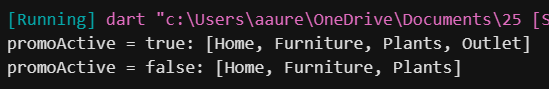

Collection if digunakan untuk menambahkan elemen 'Outlet' secara kondisional ke dalam list. Ketika promoActive bernilai true, elemen 'Outlet' ditambahkan ke dalam list sehingga list berisi 4 elemen. Ketika promoActive bernilai false, elemen tersebut tidak ditambahkan sehingga list hanya berisi 3 elemen awal.

## Praktikum 4 - Langkah 5

Menambahkan kode. Kemudian apa yang terjadi ? Jika terjadi error, silakan perbaiki. Tunjukkan hasilnya jika variabel login mempunyai kondisi lain.

**Jawaban :**

```dart
void main() {
  // Collection if dengan kondisi berbeda
  String login = 'Manager'; // Ubah nilai ini untuk melihat perbedaan

  var nav2 = [
    'Home',
    'Furniture',
    'Plants',
    if (login == 'Manager') 'Inventory',
  ];
  print('login = "Manager": $nav2');

  // Kondisi lain
  login = 'Guest';
  var nav3 = [
    'Home',
    'Furniture',
    'Plants',
    if (login == 'Manager') 'Inventory',
  ];
  print('login = "Guest": $nav3');
}
```

Output :

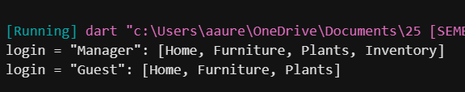

Kode awal (pada soal) memiliki error karena penulisan kondisi yang salah (if (login case 'Manager') seharusnya if (login == 'Manager')). Setelah diperbaiki, ketika login bernilai "Manager", elemen 'Inventory' ditambahkan ke list. Ketika login bernilai selain "Manager", elemen tersebut tidak ditambahkan.

## Praktikum 4 - Langkah 6

Menambahkan kode. Kemudian apa yang terjadi ? Jika terjadi error, silakan perbaiki. Jelaskan manfaat Collection For dan dokumentasikan hasilnya.

**Jawaban :**

```dart
void main() {
  var listOfInts = [1, 2, 3];
  var listOfStrings = ['#0', for (var i in listOfInts) '#$i'];
  assert(listOfStrings[1] == '#1');
  print('listOfStrings: $listOfStrings');
}
```

Output :

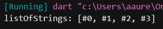

## Praktikum 5 - Langkah 1 dan 2

Menyalin kode. Kemudian silakan coba eksekusi (Run) kode pada langkah 1 tersebut. Apa yang terjadi? Jelaskan! Lalu perbaiki jika terjadi error.

**Jawaban :**

```dart
void main() {
  var record = ('first', a: 2, b: true, 'last');
  print(record);
}
```

Output :

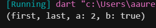

Kode berjalan tanpa error. Record adalah tipe data anonim yang dapat menyimpan beberapa nilai dengan tipe berbeda. Record ini memiliki dua positional field ('first' di posisi $1 dan 'last' di posisi $2) serta dua named field (a dan b). Hasil cetakan menunjukkan seluruh isi record.

## Praktikum 5 - Langkah 3

Menambahkan kode. Apa yang terjadi ? Jika terjadi error, silakan perbaiki. Gunakan fungsi tukar() di dalam main() sehingga tampak jelas proses pertukaran value field di dalam Records.

**Jawaban :**

```dart
(int, int) tukar((int, int) record) {
  var (a, b) = record;
  return (b, a);
}

void main() {
  var pair = (10, 20);
  print('Sebelum ditukar: $pair');
  var swapped = tukar(pair);
  print('Setelah ditukar: $swapped');
}
```

Output :

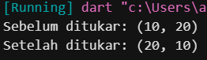

Fungsi tukar() menerima record berisi dua integer, menukar posisinya, lalu mengembalikan record baru. Tidak terjadi error. Program menampilkan proses pertukaran nilai dari (10, 20) menjadi (20, 10).

## Praktikum 5 - Langkah 4

Menambahkan kode. Apa yang terjadi ? Jika terjadi error, silakan perbaiki. Inisialisasi field nama dan NIM Anda pada variabel record mahasiswa di atas. Dokumentasikan hasilnya dan buat laporannya!

**Jawaban :**

```dart
void main() {
  // Record type annotation
  (String, int) mahasiswa;
  mahasiswa = ('Aurellia Mezaluna', 244107060021);
  print(mahasiswa);
}
```

Output :

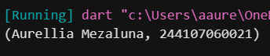

Variabel mahasiswa dideklarasikan dengan tipe record (String, int) tetapi belum diinisialisasi. Jika langsung diprint akan error karena variabel belum memiliki nilai. Setelah diinisialisasi dengan nama dan NIM, program berjalan normal dan mencetak (Aurellia Mezaluna, 244107060021).

## Praktikum 5 - Langkah 5

Menambahkan kode. Kemudian apa yang terjadi ? Jika terjadi error, silakan perbaiki. Gantilah salah satu isi record dengan nama dan NIM Anda, lalu dokumentasikan hasilnya dan buat laporannya!

**Jawaban :**

```dart
void main() {
  var mahasiswa2 = (
    'Aurellia Mezaluna',
    nim: 244107060021,
    b: true,
    'Sistem Infromasi Bisnis',
  );

  print(mahasiswa2.$1); // Prints nama
  print(mahasiswa2.nim); // Prints NIM
  print(mahasiswa2.b); // Prints true
  print(mahasiswa2.$2); // Prints jurusan
}
```

Output :

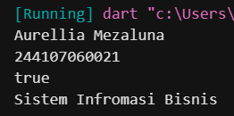

Record mengakses positional field menggunakan sintaks $1, $2, dst., dan mengakses named field menggunakan namanya langsung. Kode berjalan tanpa error. Isi record telah diganti dengan nama (positional $1), NIM (named nim), dan jurusan (positional $2).

## Tugas Praktikum

1. Jelaskan yang dimaksud Functions dalam bahasa Dart!
2. Jelaskan jenis-jenis parameter di Functions beserta contoh sintaksnya!
3. Jelaskan maksud Functions sebagai first-class objects beserta contoh sintaknya!
4. Apa itu Anonymous Functions? Jelaskan dan berikan contohnya!
5. Jelaskan perbedaan Lexical scope dan Lexical closures! Berikan contohnya!
6. Jelaskan dengan contoh cara membuat return multiple value di Functions!

**Jawaban :**

1. Functions adalah blok kode yang dapat dipanggil untuk menjalankan tugas tertentu.
2. Ada dua jenis parameter: required positional parameters (wajib dan sesuai urutan) dan optional parameters. Optional dapat berupa named parameters (dibungkus {}) yang dipanggil dengan nama, atau positional parameters (dibungkus []) yang opsional sesuai urutan. Contoh: void fungsi(String a, {int? b}) dan void fungsi(String a, [int? b]).
3. Fungsi dapat disimpan ke variabel, dikirim sebagai argumen, atau dikembalikan dari fungsi lain. Contoh:

```dart
void cetak(String msg) => print(msg);
var fungsi = cetak;
fungsi('Halo');
```

4. Digunakan sebagai argumen atau disimpan ke variabel. Contoh:

```dart
var list = [1, 2, 3];
list.forEach((item) {
  print(item);
});
```

5. Lexical scope berarti variabel hanya dapat diakses dalam blok tempat ia dideklarasikan. Lexical closure adalah fungsi yang dapat mengakses variabel dari scope induknya meskipun fungsi tersebut dipanggil di luar scope induk. Contoh:

```dart
Function buatCounter() {
  int count = 0;
  return () => count++; // closure mengakses count
}
var counter = buatCounter();
counter();
```

6. Dapat menggunakan Records untuk mengembalikan beberapa nilai dengan tipe berbeda. Contoh:

```dart
(String, int) data() {
  return ('Aurellia', 244107060021);
}
void main() {
  var (nama, nim) = data();
  print('$nama - $nim');
}
```

=======

# PemrogramanMobile_04

> > > > > > > 67df06681bd67018fe8b0e38e666ca0a9bd9a787
