# Laporan Pertemuan 6

## Identitas Mahasiswa

| Atribut | Nilai                  |
| ------- | ---------------------- |
| Nama    | Aurellia Mezaluna Azwa |
| NIM     | 244107060021           |
| Kelas   | SIB-2D                 |

## Praktikum 1 - Langkah 1

Buatlah sebuah project flutter baru dengan nama layout_flutter. Atau sesuaikan style laporan praktikum yang Anda buat.

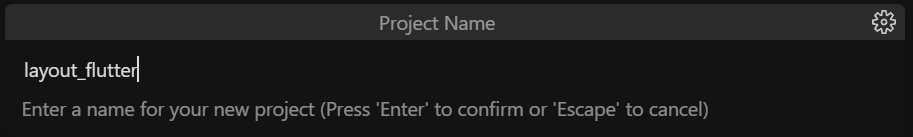

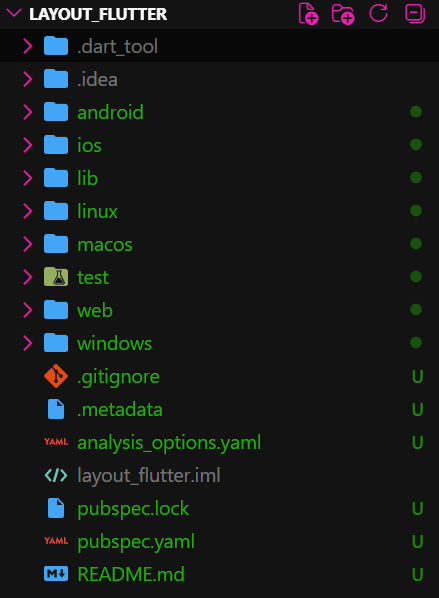

## Praktikum 1 - Langkah 2

Buka file main.dart lalu ganti dengan kode berikut. Isi nama dan NIM Anda di text title.

```dart
import 'package:flutter/material.dart';

void main() => runApp(const MyApp());

class MyApp extends StatelessWidget {
  const MyApp({super.key});

  @override
  Widget build(BuildContext context) {
    return MaterialApp(
      title: 'Flutter layout: Nama dan NIM Anda',
      home: Scaffold(
        appBar: AppBar(
          title: const Text('Flutter layout demo'),
        ),
        body: const Center(
          child: Text('Hello World'),
        ),
      ),
    );
  }
}
```

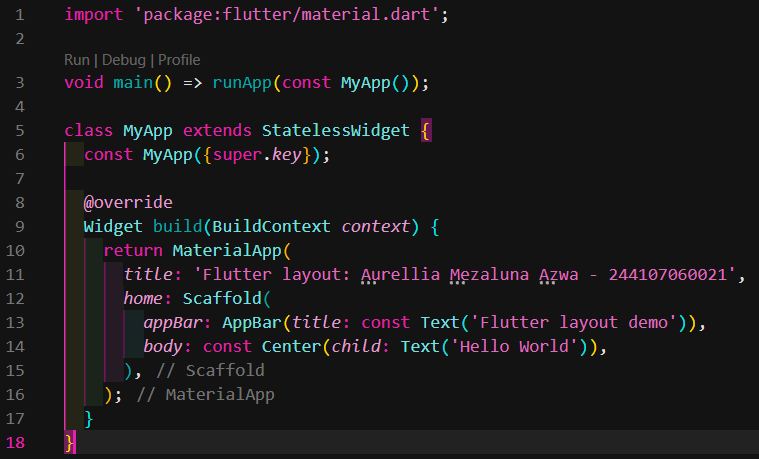

## Praktikum 1 - Langkah 3

Langkah pertama adalah memecah tata letak menjadi elemen dasarnya:

Identifikasi baris dan kolom.
Apakah tata letaknya menyertakan kisi-kisi (grid)?
Apakah ada elemen yang tumpang tindih?
Apakah UI memerlukan tab?
Perhatikan area yang memerlukan alignment, padding, atau borders.

## Praktikum 1 - Langkah 4

Pertama, Anda akan membuat kolom bagian kiri pada judul. Tambahkan kode berikut di bagian atas metode build() di dalam kelas MyApp:

```dart
    Widget titleSection = Container(
      padding: const EdgeInsets.all(32.0),
      child: Row(
        children: [
          // Soal 1: Expanded dengan Column di dalamnya
          Expanded(
            child: Column(
              crossAxisAlignment: CrossAxisAlignment.start,
              children: [
                Container(
                  padding: const EdgeInsets.only(bottom: 8.0),
                  child: const Text(
                    'Wisata Gunung di Batu',
                    style: TextStyle(fontWeight: FontWeight.bold),
                  ),
                ),
                // Soal 2: Teks dengan warna abu-abu
                const Text(
                  'Batu, Malang, Indonesia',
                  style: TextStyle(color: Colors.grey),
                ),
              ],
            ),
          ),

          const Icon(
            Icons.star,
            color: Colors.red,
          ),
          const Text(
            '41',
            style: TextStyle(fontWeight: FontWeight.bold),
          ),
        ],
      ),
    );

    return MaterialApp(
      title: 'Flutter layout: Aurellia Mezaluna Azwa - 244107060021',
      home: Scaffold(
        appBar: AppBar(title: const Text('Flutter layout demo')),
        body: Center(child: titleSection),
      ),
    );
```

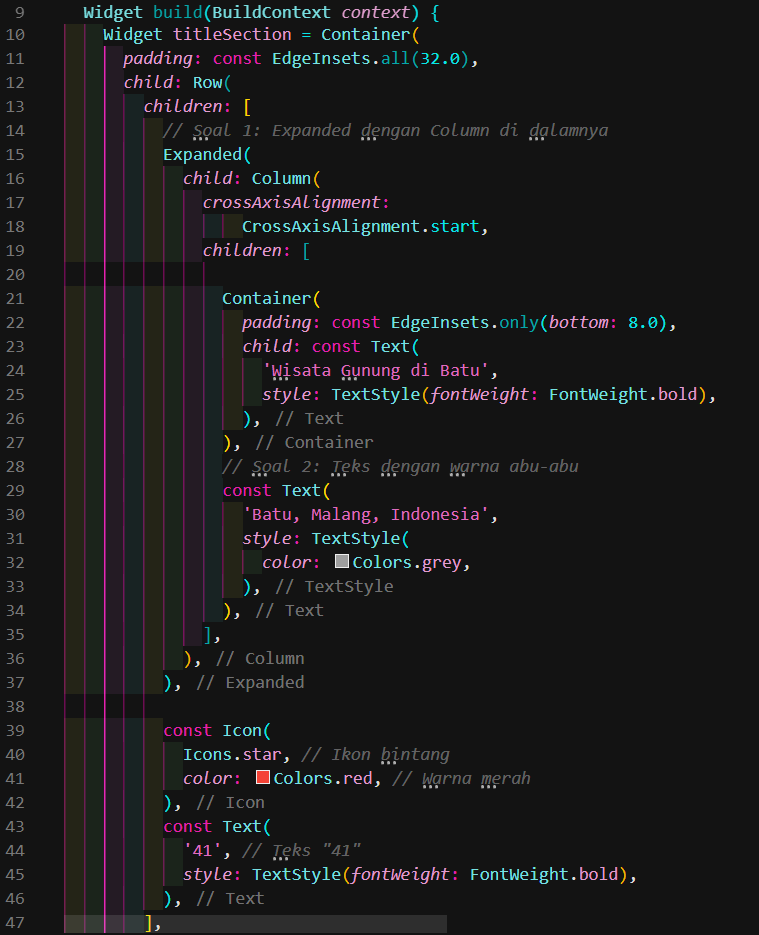

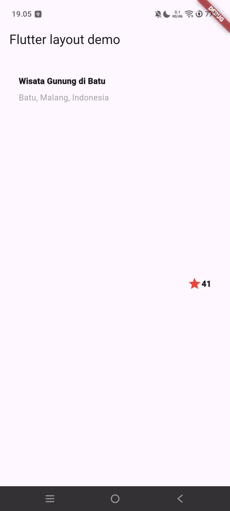

## Praktikum 2 - Langkah 1 - 2 - 3

Buat method Column \_buildButtonColumn
Bagian tombol berisi 3 kolom yang menggunakan tata letak yang sama—sebuah ikon di atas baris teks. Kolom pada baris ini diberi jarak yang sama, dan teks serta ikon diberi warna primer.

Karena kode untuk membangun setiap kolom hampir sama, buatlah metode pembantu pribadi bernama buildButtonColumn(), yang mempunyai parameter warna, Icon dan Text, sehingga dapat mengembalikan kolom dengan widgetnya sesuai dengan warna tertentu.

```dart
class MyApp extends StatelessWidget {
  const MyApp({super.key});

  @override
  Widget build(BuildContext context) {
    // ···
  }

  Column _buildButtonColumn(Color color, IconData icon, String label) {
    return Column(
      mainAxisSize: MainAxisSize.min,
      mainAxisAlignment: MainAxisAlignment.center,
      children: [
        Icon(icon, color: color),
        Container(
          margin: const EdgeInsets.only(top: 8),
          child: Text(
            label,
            style: TextStyle(
              fontSize: 12,
              fontWeight: FontWeight.w400,
              color: color,
            ),
          ),
        ),
      ],
    );
  }
}
```

Buat widget buttonSection
Buat Fungsi untuk menambahkan ikon langsung ke kolom. Teks berada di dalam Container dengan margin hanya di bagian atas, yang memisahkan teks dari ikon.

```dart
Color color = Theme.of(context).primaryColor;

Widget buttonSection = Row(
mainAxisAlignment: MainAxisAlignment.spaceEvenly,
children: [
_buildButtonColumn(color, Icons.call, 'CALL'),
_buildButtonColumn(color, Icons.near_me, 'ROUTE'),
_buildButtonColumn(color, Icons.share, 'SHARE'),
],
);
```

Tambah button section ke body

Tambahkan variabel buttonSection ke dalam body seperti berikut:

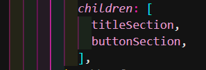

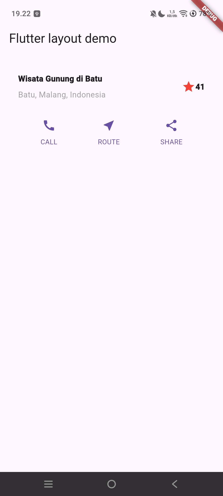

## Praktikum 3 - Langkah 1

Buat widget textSection
Tentukan bagian teks sebagai variabel. Masukkan teks ke dalam Container dan tambahkan padding di sepanjang setiap tepinya. Tambahkan kode berikut tepat di bawah deklarasi buttonSection:

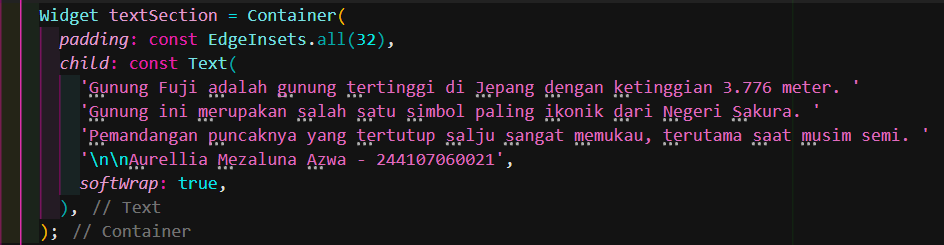

## Praktikum 3 - Langkah 2

Tambahkan variabel text section ke body

Tambahkan widget variabel textSection ke dalam body seperti berikut:

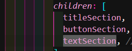

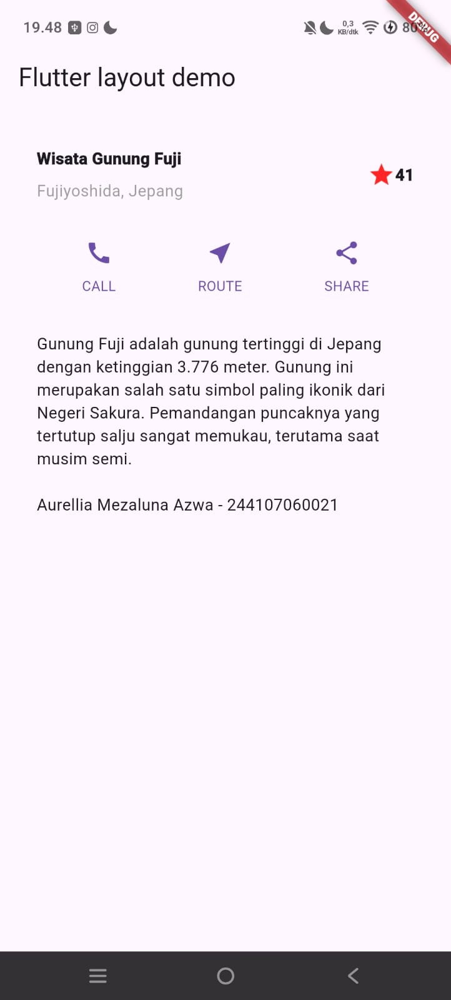

## Praktikum 4 - Langkah 1

Siapkan aset gambar
Anda dapat mencari gambar di internet yang ingin ditampilkan. Buatlah folder images di root project layout_flutter. Masukkan file gambar tersebut ke folder images, lalu set nama file tersebut ke file pubspec.yaml seperti berikut:

```dart
flutter:
  uses-material-design: true
  assets:
    - img/prak1/fuji.jpeg
```

## Praktikum 4 - Langkah 2

Tambahkan gambar ke body
Tambahkan aset gambar ke dalam body seperti berikut:

```dart
            Image.asset(
              'img/prak1/fuji.jpeg',
              width: 600,
              height: 240,
              fit: BoxFit.cover,
            ),
```

## Praktikum 4 - Langkah 3

Pada langkah terakhir ini, atur semua elemen dalam ListView, bukan Column, karena ListView mendukung scroll yang dinamis saat aplikasi dijalankan pada perangkat yang resolusinya lebih kecil.

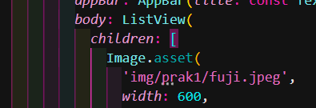

## Output Praktikum 4 Langkah 1-3

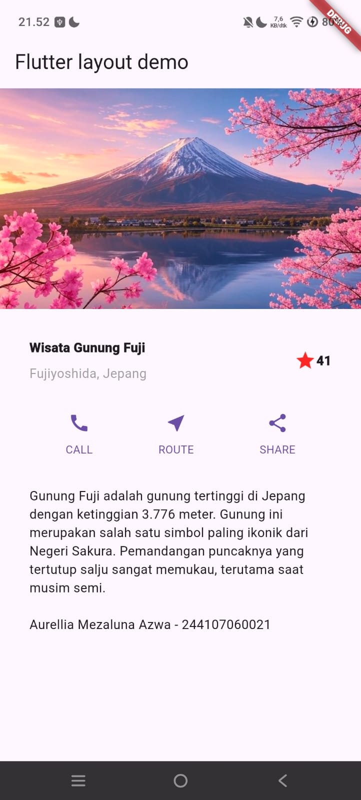

## Praktikum 5 - Langkah 1

Sebelum melanjutkan praktikum, buatlah sebuah project baru Flutter dengan nama belanja dan susunan folder seperti pada gambar berikut. Penyusunan ini dimaksudkan untuk mengorganisasi kode dan widget yang lebih mudah.

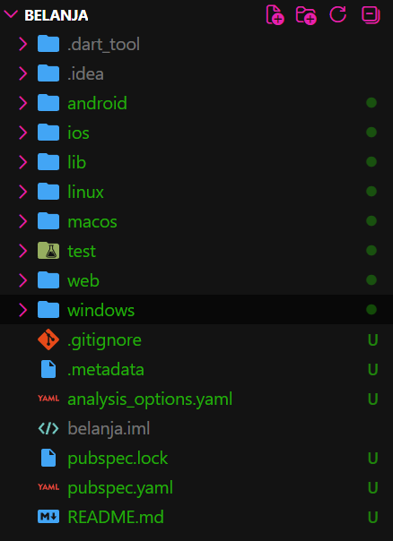

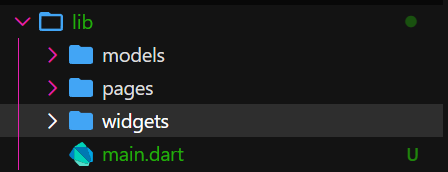

## Praktikum 5 - Langkah 2

Buatlah dua buah file dart dengan nama home_page.dart dan item_page.dart pada folder pages. Untuk masing-masing file, deklarasikan class HomePage pada file home_page.dart dan ItemPage pada item_page.dart. Turunkan class dari StatelessWidget. Gambaran potongan kode dapat anda lihat sebagai berikut.

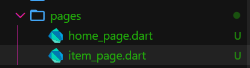

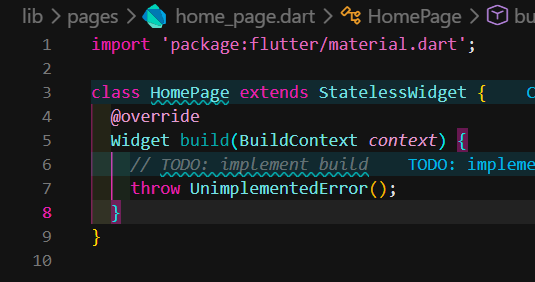

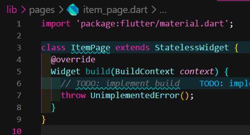

## Praktikum 5 - Langkah 3

Setelah kedua halaman telah dibuat dan didefinisikan, bukalah file main.dart. Pada langkah ini anda akan mendefinisikan Route untuk kedua halaman tersebut. Definisi penamaan route harus bersifat unique. Halaman HomePage didefinisikan sebagai /. Dan halaman ItemPage didefinisikan sebagai /item. Untuk mendefinisikan halaman awal, anda dapat menggunakan named argument initialRoute. Gambaran tahapan ini, dapat anda lihat pada potongan kode berikut

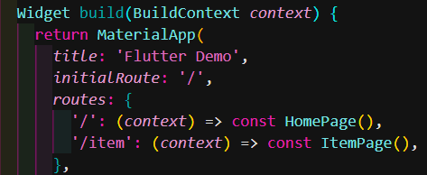

## Praktikum 5 - Langkah 4

Sebelum melakukan perpindahan halaman dari HomePage ke ItemPage, dibutuhkan proses pemodelan data. Pada desain mockup, dibutuhkan dua informasi yaitu nama dan harga. Untuk menangani hal ini, buatlah sebuah file dengan nama item.dart dan letakkan pada folder models. Pada file ini didefinisikan pemodelan data yang dibutuhkan. Ilustrasi kode yang dibutuhkan, dapat anda lihat pada potongan kode berikut.

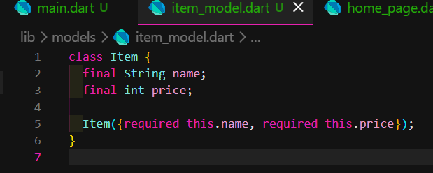

## Praktikum 5 - Langkah 5

Pada halaman HomePage terdapat ListView widget. Sumber data ListView diambil dari model List dari object Item. Gambaran kode yang dibutuhkan untuk melakukan definisi model dapat anda lihat sebagai berikut.

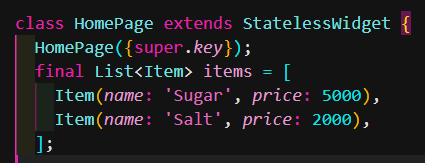

## Praktikum 5 - Langkah 6

```dart
body: Container(
  margin: EdgeInsets.all(8),
  child: ListView.builder(
    padding: EdgeInsets.all(8),
    itemCount: items.length,
    itemBuilder: (context, index) {
      final item = items[index];
      return Card(
        child: Container(
          margin: EdgeInsets.all(8),
          child: Row(
            children: [
              Expanded(child: Text(item.name)),
              Expanded(
                child: Text(
                  item.price.toString(),
                  textAlign: TextAlign.end,
                ), // Text
              ) // Expanded
            ],
          ), // Row
        ), // Container
      ); // Card
    },
  ), // ListView.builder
), // Container
```

## Praktikum 5 - Langkah 7

Item pada ListView saat ini ketika ditekan masih belum memberikan aksi tertentu. Untuk menambahkan aksi pada ListView dapat digunakan widget InkWell atau GestureDetector. Perbedaan utamanya InkWell merupakan material widget yang memberikan efek ketika ditekan. Sedangkan GestureDetector bersifat umum dan bisa juga digunakan untuk gesture lain selain sentuhan. Pada praktikum ini akan digunakan widget InkWell.

```dart
return InkWell(
  onTap: () {
    Navigator.pushNamed(context, '/item');
  },
```

## OUTPUT KESELURUHAN

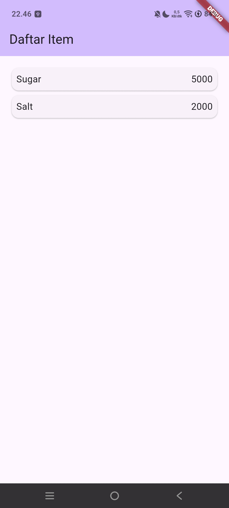

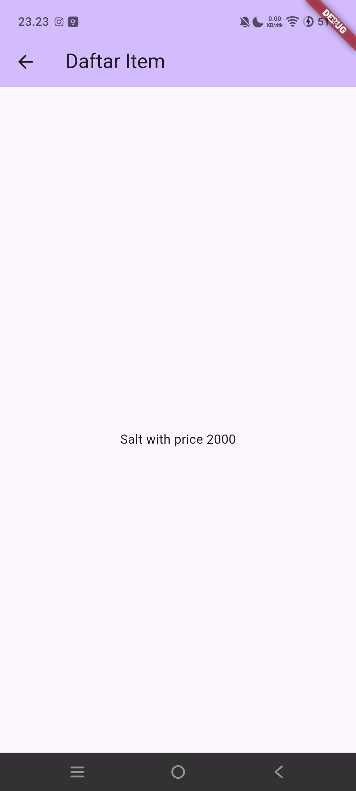
