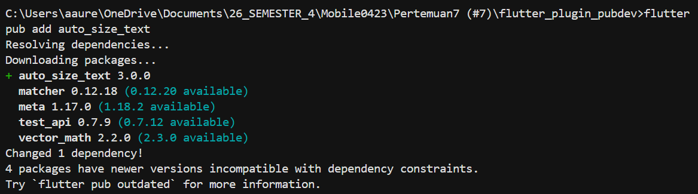
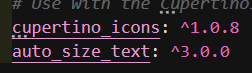
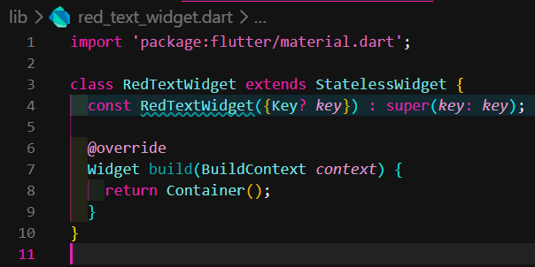
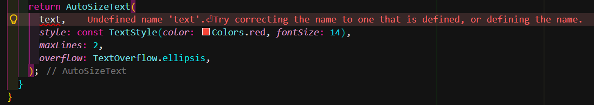
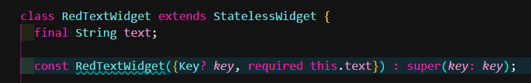
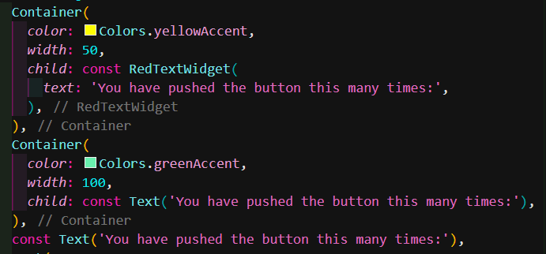
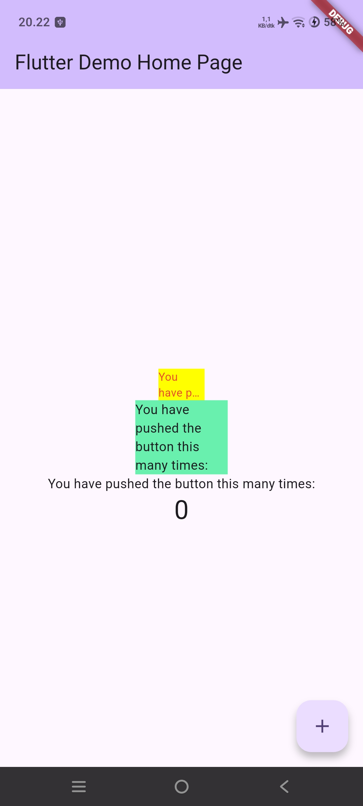

# Laporan Pertemuan 7 (#7)

## Identitas Mahasiswa

| Atribut | Nilai                  |
| ------- | ---------------------- |
| Nama    | Aurellia Mezaluna Azwa |
| NIM     | 244107060021           |
| Kelas   | SIB-2D                 |

## Praktikum 1 - Langkah 1: Buat Project Baru

Buatlah sebuah project flutter baru dengan nama flutter_plugin_pubdev. Lalu jadikan repository di GitHub Anda dengan nama flutter_plugin_pubdev.

**Output**

## Langkah 2: Menambahkan Plugin

Tambahkan plugin auto_size_text menggunakan perintah berikut di terminal

**Output**

## Langkah 3: Buat file red_text_widget.dart

Buat file baru bernama red_text_widget.dart di dalam folder lib lalu isi kode seperti berikut.

**Output**

## Langkah 4: Tambah Widget AutoSizeText

Masih di file red_text_widget.dart, untuk menggunakan plugin auto_size_text, ubahlah kode return Container() menjadi seperti berikut.

**Output**

Error terjadi karena variabel text belum didefinisikan. AutoSizeText membutuhkan parameter string text untuk ditampilkan, tetapi variabel tersebut belum ada di dalam class RedTextWidget.

## Langkah 5: Buat Variabel text dan parameter di constructor

Tambahkan variabel text dan parameter di constructor seperti berikut.

**Output**

## Langkah 6: Tambahkan widget di main.dart

Buka file main.dart lalu tambahkan di dalam children: pada class \_MyHomePageState

**Output**

## HASIL RUNNING

## TUGAS PRAKTIKUM

### 1. Jelaskan maksud dari langkah 2 pada praktikum tersebut!

Langkah 2 bertujuan menambahkan plugin auto_size_text ke project menggunakan perintah flutter pub add auto_size_text, yang otomatis mendownload package dan menambahkannya ke file pubspec.yaml.

### 2. Jelaskan maksud dari langkah 5 pada praktikum tersebut!

Langkah 5 bertujuan menambahkan variabel text dan parameter required this.text di constructor agar widget bisa menerima input teks dari luar dan menampilkannya.

### 3. Pada langkah 6 terdapat dua widget yang ditambahkan, jelaskan fungsi dan perbedaannya!

Dua widget yang ditambahkan adalah RedTextWidget (menggunakan plugin AutoSizeText) dan Text biasa. Fungsi RedTextWidget adalah menampilkan teks berwarna merah yang otomatis menyesuaikan ukuran font agar muat dalam lebar container 50 piksel (kuning) maksimal 2 baris, sedangkan Text biasa menampilkan teks dengan ukuran default tanpa penyesuaian. Perbedaannya: pada container kuning lebar 50, teks menjadi "You have pushed..." karena dipotong dan diperkecil otomatis, sedangkan container hijau lebar 100 dengan Text biasa masih menampilkan teks utuh.

### 4. Jelaskan maksud dari tiap parameter yang ada di dalam plugin auto_size_text berdasarkan tautan pada dokumentasi ini!

text: teks yang akan ditampilkan

style: gaya teks (warna, ukuran font maksimal)

maxLines: batas jumlah baris maksimal

overflow: perilaku jika teks kelebihan (ellipsis = tanda "...")

minFontSize: ukuran font minimal saat mengecil

presetFontSizes: daftar ukuran font yang dicoba

group: menyamakan ukuran font antar beberapa AutoSizeText
