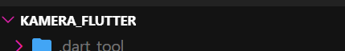
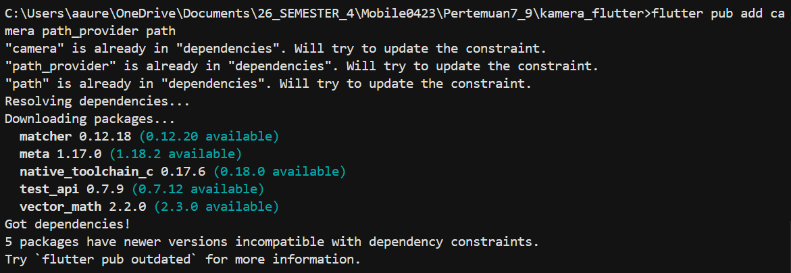
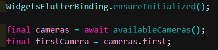
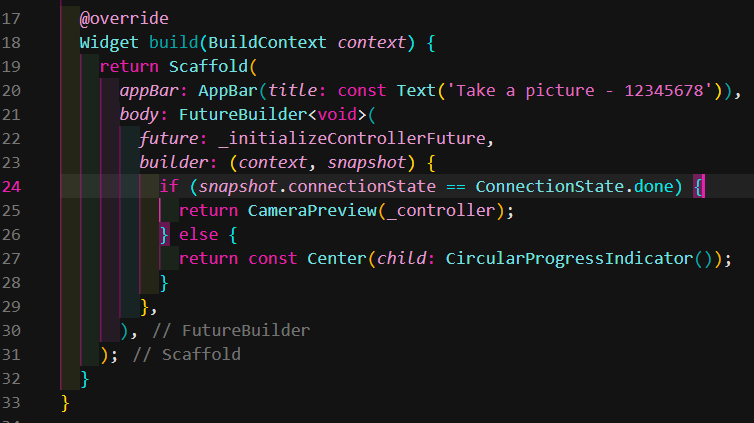

# Laporan Pertemuan 7 (#9)

## Identitas Mahasiswa

| Atribut | Nilai                  |
| ------- | ---------------------- |
| Nama    | Aurellia Mezaluna Azwa |
| NIM     | 244107060021           |
| Kelas   | SIB-2D                 |

## Praktikum 1 - Langkah 1

Buatlah sebuah project flutter baru dengan nama kamera_flutter, lalu sesuaikan style laporan praktikum yang Anda buat.



## Praktikum 1 - Langkah 2

Untuk menambahkan dependensi plugin, jalankan perintah flutter pub add seperti berikut di terminal:

**Output**



## Praktikum 1 - Langkah 3

Selanjutnya, kita perlu mengecek jumlah kamera yang tersedia pada perangkat menggunakan plugin camera seperti pada kode berikut ini. Kode ini letakkan dalam void main().

**Output**



## Praktikum 1 - Langkah 4

Setelah Anda dapat mengakses kamera, gunakan langkah-langkah berikut untuk membuat dan menginisialisasi CameraController. Pada langkah berikut ini, Anda akan membuat koneksi ke kamera perangkat yang memungkinkan Anda untuk mengontrol kamera dan menampilkan pratinjau umpan kamera.

**Output**

```dart
import 'package:flutter/material.dart';
import 'package:camera/camera.dart';

class TakePictureScreen extends StatefulWidget {
  final CameraDescription camera;

  const TakePictureScreen({
    super.key,
    required this.camera,
  });

  @override
  TakePictureScreenState createState() => TakePictureScreenState();
}

class TakePictureScreenState extends State<TakePictureScreen> {
  late CameraController _controller;
  late Future<void> _initializeControllerFuture;

  @override
  void initState() {
    super.initState();
    _controller = CameraController(
      widget.camera,
      ResolutionPreset.medium,
    );
    _initializeControllerFuture = _controller.initialize();
  }

  @override
  void dispose() {
    _controller.dispose();
    super.dispose();
  }

  @override
  Widget build(BuildContext context) {
    return Container();
  }
}
```

## Praktikum 1 - Langkah 5

Gunakan widget CameraPreview dari package camera untuk menampilkan preview foto. Anda perlu tipe objek void berupa FutureBuilder untuk menangani proses async.

**Output**


