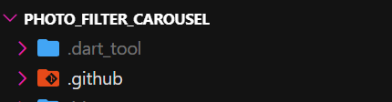

# Laporan Pertemuan 7 (#9)

## Identitas Mahasiswa

| Atribut | Nilai                  |
| ------- | ---------------------- |
| Nama    | Aurellia Mezaluna Azwa |
| NIM     | 244107060021           |
| Kelas   | SIB-2D                 |

## Praktikum 2 - Langkah 1: Buat project baru

Membuat project flutter baru di pertemuan 09 dengan nama photo_filter_carousel

**Output**

## Praktikum 2 - Langkah 2: Buat widget Selector ring dan dark gradient

Membuat folder widget dan file baru yang berisi kode berikut.
